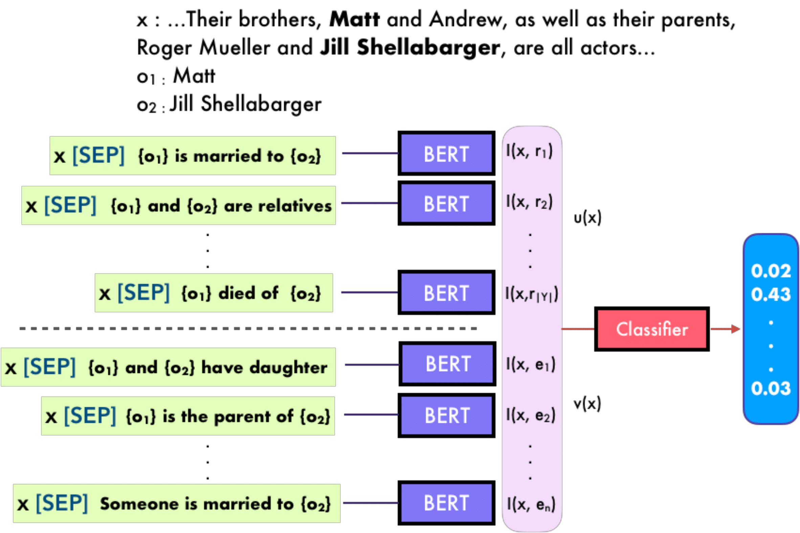

# ExpBERT: Representation Engineering with Natural Language Explanations

<p align="center">
  
</p>

This repository contains code, scripts, data and checkpoints for running experiments in the following paper:
> Shikhar Murty, Pang Wei Koh, Percy Liang
>
> [ExpBERT: Representation Engineering with Natural Language Explanations]

The experiments uses datasets and precomputed features which can be downloaded here:
- Spouse ([Hancock et al., 2018](https://arxiv.org/abs/1805.03818)): [download](https://drive.google.com/drive/folders/18x2l0oEnudXATN0K91L75uT_Ag0YF_6P?usp=sharing)
- Disease: ([Wei et al., 2015](https://www.researchgate.net/profile/Yifan_Peng2/publication/288971322_Overview_of_the_BioCreative_V_chemical_disease_relation_CDR_task/links/56b2353708ae56d7b06cabe9.pdf)): [download](https://drive.google.com/drive/folders/1fZEFbWX0e7IZhzNPDroeD8gzu0VoERxt?usp=sharing)
- TACRED ([Zhang et al., 2017](https://nlp.stanford.edu/projects/tacred/)): for access, please contact the [dataset creators](https://nlp.stanford.edu/projects/tacred/) directly.

## Abstract

## Dependencies

Install all dependencies using `conda`:
```
conda env create -f environment.yml
conda activate lang-supervision
pip install -e .
```

## Setup

To run our code, first download the data/features into `$DATA_DIR`. The main point of entry to the code is `run.py`. Below we provide commands to train models on the `Spouse` dataset. To modify it for `Disease` set `--task_name disease` and to modify it for `TACRED`, set `--task_name tacred` and  `--num_classes 42`:

### NoExp

`python run.py --data_dir $DATA_DIR/spouse --train --num_train_epochs 100 --task_name spouse --classifier_type feature_concat --exp_dir input-features --num_classes 2 --train_distributed 0 --dev_distributed 0 --save_model --output_dir $outdir`

### Semparse (ProgExp) / Semparse (LangExp) / Patterns

`python run.py --data_dir $DATA_DIR/spouse --train --num_train_epochs 100 --task_name spouse --classifier_type feature_concat --exp_dir input-features --feat_dir $feat --num_classes 2 --train_distributed 0 --dev_distributed 0 --save_model --output_dir $outdir`

where `$feat` is semparse-progexp-features, semparse-langexp-features or regex-features based on the interpreter needed.

### ExpBERT

`python run.py --data_dir $DATA_DIR/spouse --train --num_train_epochs 100 --task_name spouse --classifier_type feature_concat --exp_dir input-features --feat_dir expbert-features --num_classes 2 --train_distributed 10 --dev_distributed 0 --save_model --output_dir $outdir`

Note that `train_distributed` is set to 10 here since inside `spouse/expbert-features` there are 10 files corresponding to the training features. This sharding is done to parallelize the creation of expbert features.

## Feature Pipeline
To produce ExpBERT features for your own dataset/explanations, we also provide a feature-pipeline. First, download a BERT/SciBERT model fine-tuned on the MultiNLI dataset from [here](https://drive.google.com/drive/folders/18mtsUyvjBU2JHtMjFG_xqSLm-q-0odPH?usp=sharing) into $BERT. 


Then create a `config.yaml` file such as the following:

```
interpreter:
    type: bert
    path: $BERT
    use_logits: False
paths:
    data_dir: $fictional_dataset_dir
    exp_dir: explanations
    save_dir: $fictional_dataset_dir/expbert-features
data_reader: reader
```

Note that while we provide readers for the datasets used in this paper, a different reader might be required for your dataset - look at `data_utils/readers.py` for more info.

Finally, run the following command to produce features: `python create_features.py --exp_config config.yaml`. 

## Model Checkpoints

Finally, we provide checkpoints for all models in our paper. The checkpoints can be found [here](https://drive.google.com/drive/folders/1cTITDWxUSMHiVYeGd0BL0mydGFanwUcW?usp=sharing). Commands for running the checkpoints can be found there as well.
